# RTNM-Group Architecture Diagrams

All diagrams are compatible with Mermaid (GitHub, Notion, VS Code Mermaid Preview, etc.)

---

## 1. System Overview

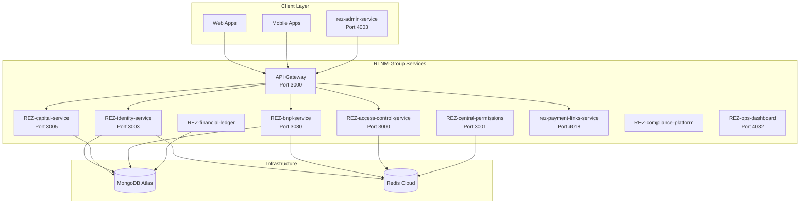

---

## 2. Identity Resolution Flow

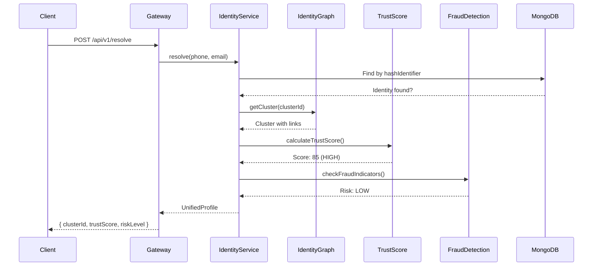

---

## 3. Loan Lifecycle Flow

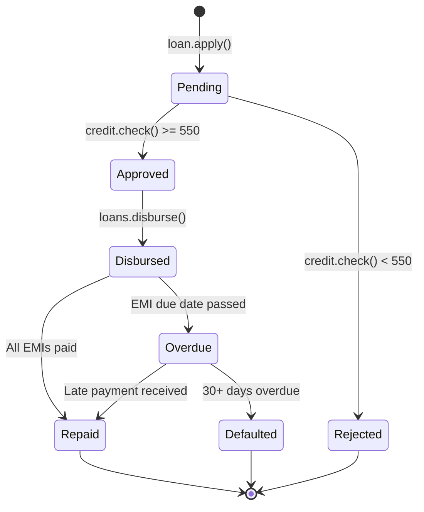

---

## 4. BNPL Processing Flow

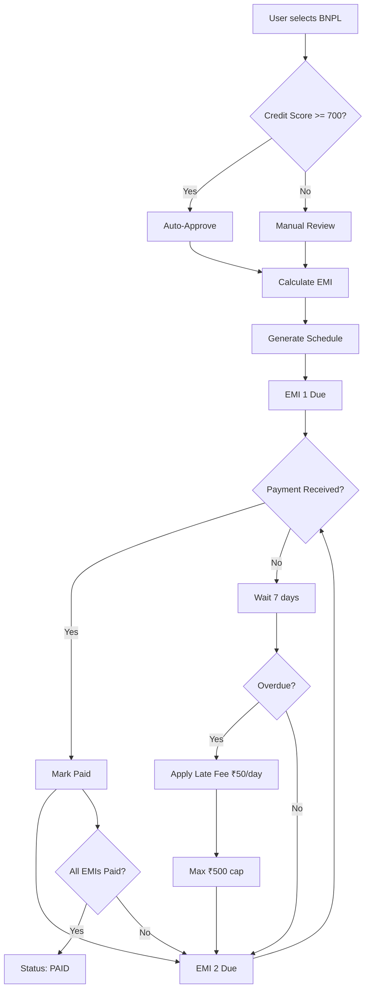

---

## 5. Access Control Decision Flow

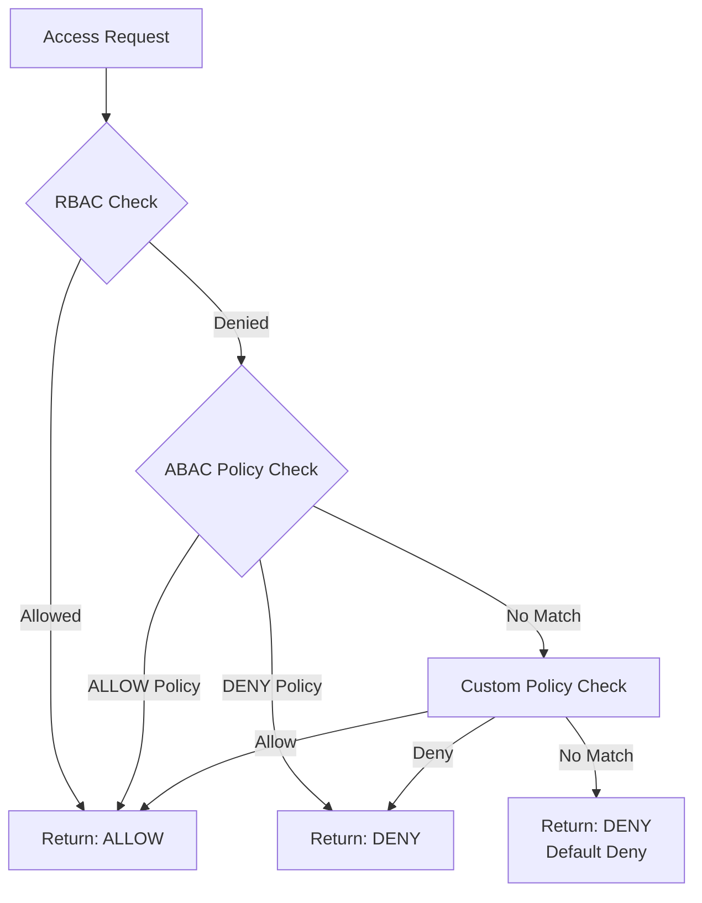

---

## 6. Service Dependency Graph

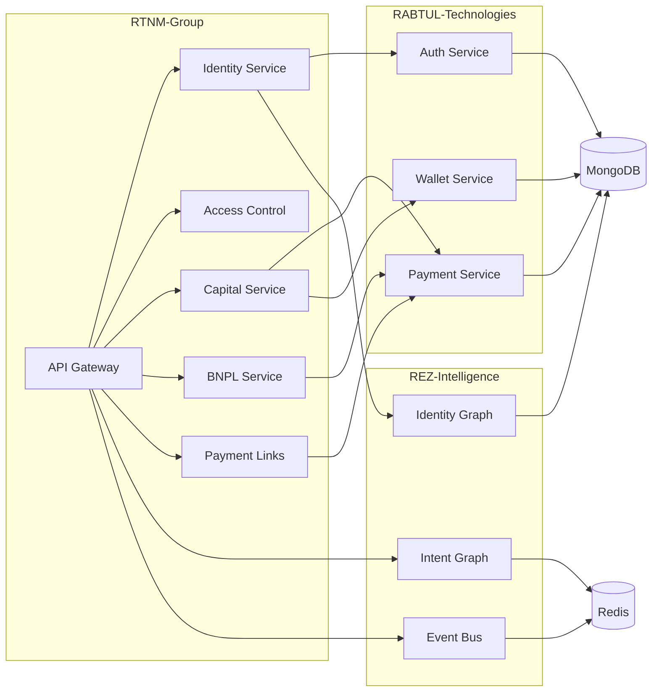

---

## 7. Database Schema Relationships

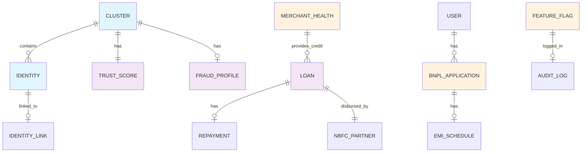

---

## 8. Rate Limiting Architecture

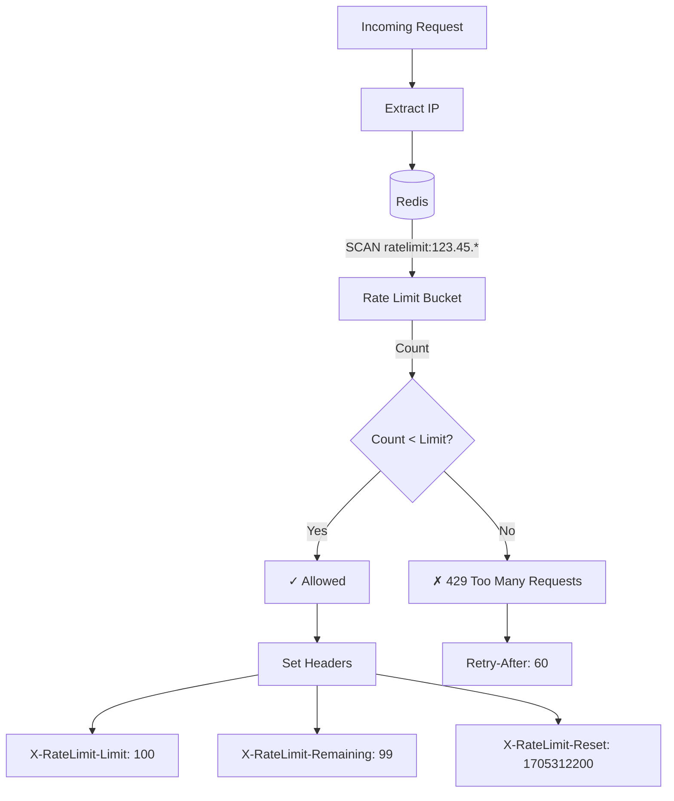

---

## 9. Multi-Tenant Architecture

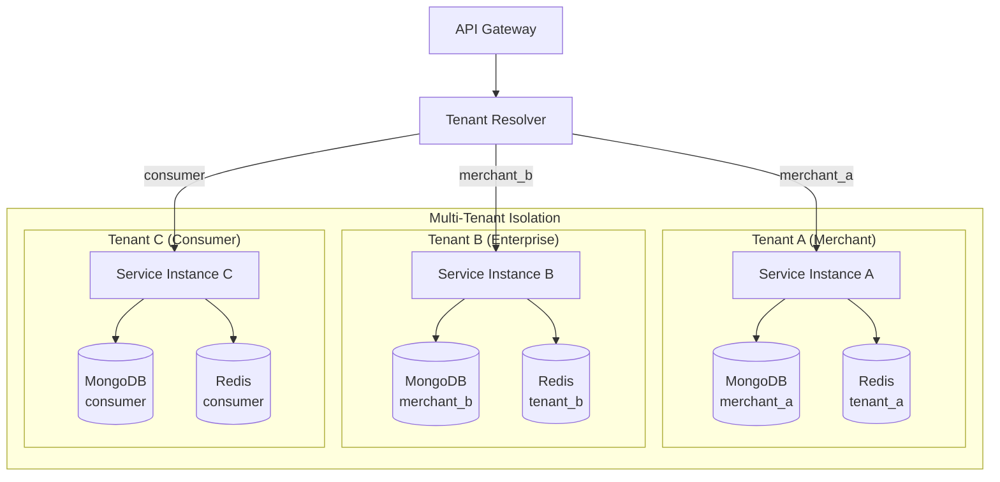

---

## 10. Security Flow

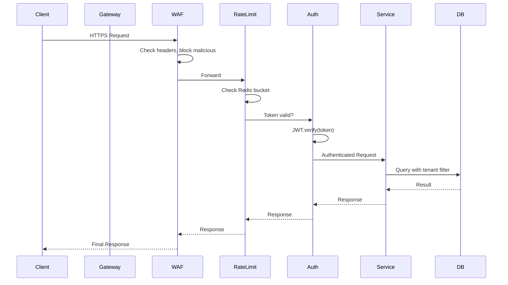

---

## 11. Event-Driven Architecture

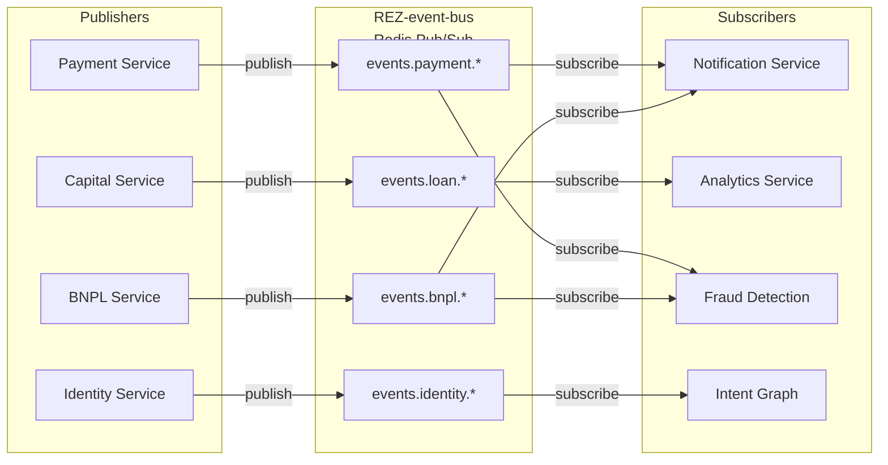

---

## 12. Deployment Architecture

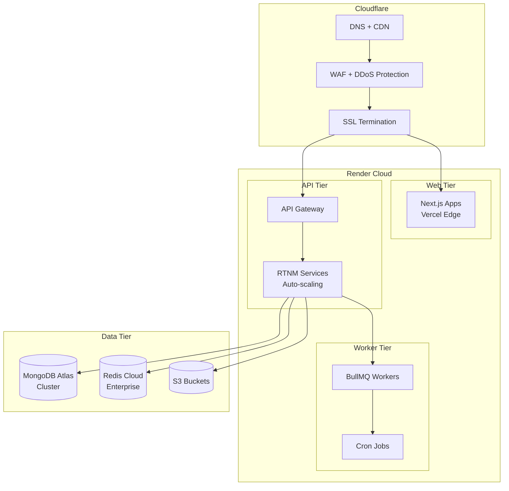

---

## 13. Data Flow for Payment Processing

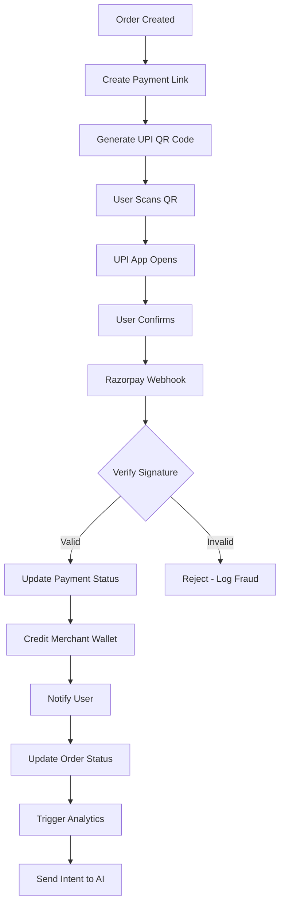

---

## 14. Credit Scoring Algorithm

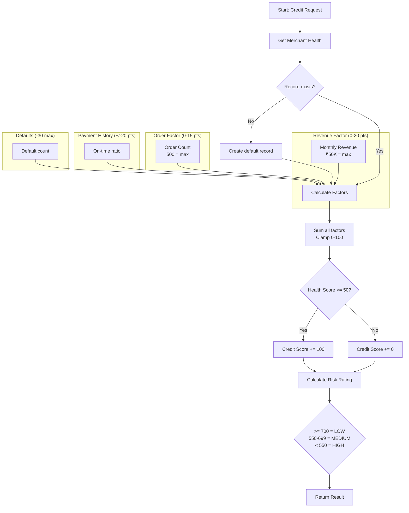

---

## 15. Failover & Recovery

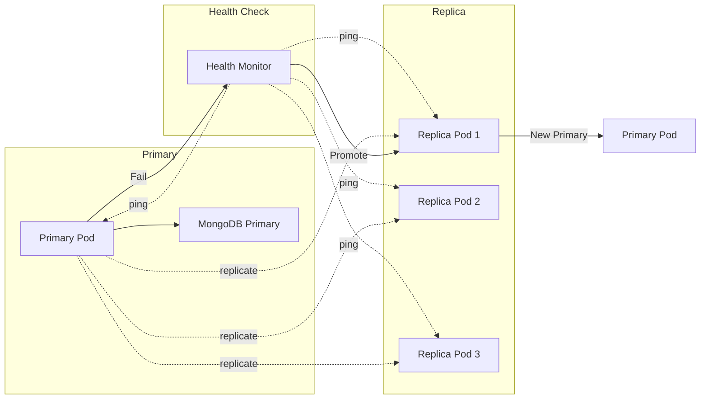
